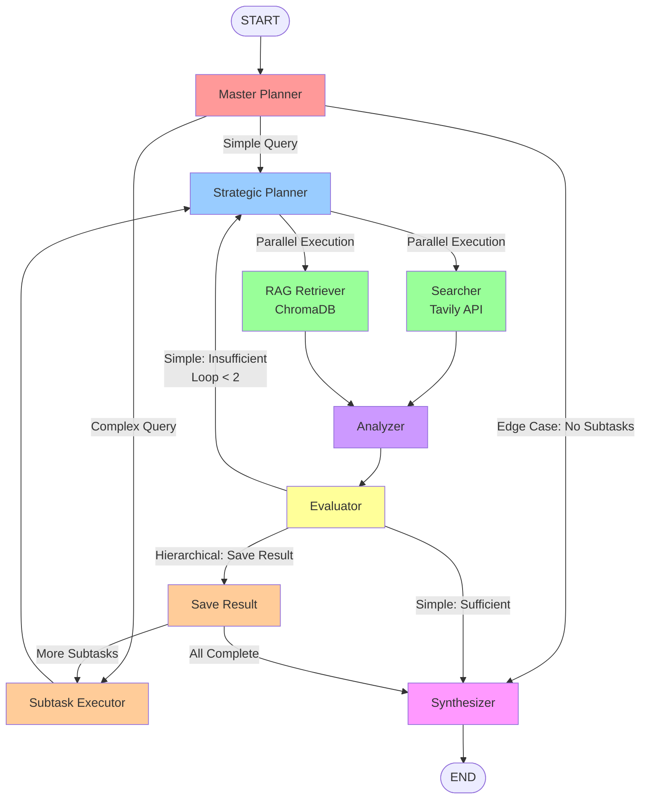
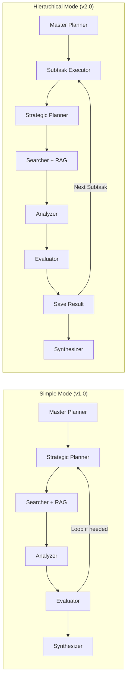
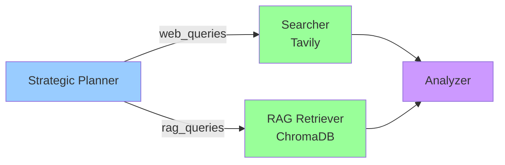

# Graph Architecture - Test-Smith Multi-Agent Research System

**Last Updated:** 2025-11-12
**Version:** 2.0-alpha (Hierarchical Task Decomposition)

## Overview

Test-Smith uses a **hierarchical multi-agent workflow** orchestrated by LangGraph. The system supports two execution modes:

- **Simple Mode:** Single-pass research for straightforward queries (legacy v1.0 behavior)
- **Hierarchical Mode:** Multi-stage decomposition for complex, multi-faceted queries (v2.0+ feature)

This document provides a comprehensive explanation of the graph structure, node responsibilities, and routing logic.

---

## Visual Graph Structure

### Complete Workflow Diagram



### Execution Mode Comparison



---

## Node Descriptions

### 1. Master Planner (Entry Point)

**File:** `src/nodes/master_planner_node.py`
**Model:** `command-r` (Ollama)
**Output Schema:** `MasterPlan` (`src/schemas.py`)

**Responsibilities:**
- Analyzes query complexity using LLM-based assessment
- Checks knowledge base (KB) contents and availability
- Determines execution mode: `simple` or `hierarchical`
- For complex queries: Decomposes into prioritized subtasks with dependencies
- Provides overall research strategy

**Output Fields:**
```python
{
    "execution_mode": "simple" | "hierarchical",
    "master_plan": MasterPlan | None,
    "current_subtask_index": 0,
    "current_subtask_id": "",
    "subtask_results": {}
}
```

**Routing Logic (via `subtask_router`):**
- **Simple mode** → Strategic Planner (existing v1.0 flow)
- **Hierarchical mode** → Subtask Executor (v2.0 decomposition)
- **Edge case** (no subtasks) → Synthesizer

**Example Master Plan:**
```json
{
  "is_complex": true,
  "execution_mode": "hierarchical",
  "subtasks": [
    {
      "subtask_id": "task_1",
      "description": "Research authentication mechanisms in internal system",
      "focus_area": "Internal Architecture",
      "priority": 1,
      "dependencies": [],
      "estimated_importance": 0.9
    },
    {
      "subtask_id": "task_2",
      "description": "Compare with OAuth2 industry best practices",
      "focus_area": "External Standards",
      "priority": 2,
      "dependencies": ["task_1"],
      "estimated_importance": 0.8
    }
  ],
  "overall_strategy": "Analyze internal implementation first, then benchmark against external standards"
}
```

---

### 2. Subtask Executor (Hierarchical Mode Only)

**File:** `src/nodes/subtask_executor.py`
**Purpose:** Prepares state for executing a single subtask

**Responsibilities:**
- Loads next subtask from master plan (by `current_subtask_index`)
- Resets per-subtask state fields:
  - `web_queries`, `rag_queries`, `allocation_strategy`
  - `search_results`, `rag_results`, `analyzed_data`
  - `evaluation`, `reason`, `loop_count`
- Sets `current_subtask_id` for tracking
- Passes subtask description to Strategic Planner as refined query

**Key Behavior:**
- Acts as a "state sanitizer" between subtasks
- Ensures each subtask gets clean slate for research loop
- Preserves `subtask_results` dict across iterations

**Flow:**
```
Subtask Executor → Strategic Planner → [Research Loop] → Save Result → [Next Subtask or Synthesize]
```

---

### 3. Strategic Planner (Per-Subtask Planning)

**File:** `src/nodes/planner_node.py`
**Model:** `llama3` (Ollama)
**Output Schema:** `StrategicPlan` (`src/schemas.py`)

**Responsibilities:**
- Analyzes query (original query in simple mode, subtask description in hierarchical mode)
- Checks KB contents using `check_kb_contents()` function
- **Strategically allocates queries** between RAG and web search:
  - **RAG queries:** Domain-specific, internal docs, established concepts
  - **Web queries:** Current events, general knowledge, external references
- Provides allocation strategy reasoning

**Output Fields:**
```python
{
    "rag_queries": ["Query 1 for KB", "Query 2 for KB"],
    "web_queries": ["Query 1 for web", "Query 2 for web"],
    "allocation_strategy": "Reasoning for this distribution..."
}
```

**Strategic Allocation Logic:**
- Checks if `chroma_db/` exists and contains documents
- Samples KB contents to understand available information
- Allocates 0-5 queries per source (RAG/web) based on:
  - KB availability and relevance
  - Query type (factual, current events, internal docs)
  - Information source optimization (saves API calls)

**Example Allocation:**
```json
{
  "rag_queries": [
    "Authentication flow in internal system",
    "Session management implementation",
    "Authorization middleware architecture"
  ],
  "web_queries": [
    "OAuth2 best practices 2025",
    "JWT security considerations"
  ],
  "allocation_strategy": "Allocated 3 RAG queries for internal architecture (KB contains system docs), 2 web queries for external standards and current best practices"
}
```

**Iterative Refinement:**
- In simple mode, evaluator can loop back to planner if information insufficient
- Planner receives `reason` field from evaluator as feedback
- Maximum 2 iterations to prevent infinite loops

---

### 4. Parallel Execution: Searcher + RAG Retriever

Both nodes execute **simultaneously** with **different query sets** (strategic allocation).

#### 4a. Searcher (Web Search)

**File:** `src/nodes/searcher_node.py`
**API:** Tavily Search API
**Input:** `web_queries` from Strategic Planner

**Responsibilities:**
- Executes web search for queries allocated to web source
- Fetches real-time information, current events, general knowledge
- Skips execution if `web_queries` is empty (saves API calls)
- Returns search results with URLs and snippets

**Output:** Appends to `search_results` (cumulative across iterations)

#### 4b. RAG Retriever (Knowledge Base)

**File:** `src/nodes/rag_retriever_node.py`
**Database:** ChromaDB (`chroma_db/` directory)
**Embedding Model:** `nomic-embed-text` (Ollama, 768 dimensions)
**Input:** `rag_queries` from Strategic Planner

**Responsibilities:**
- Performs vector similarity search in ChromaDB collection
- Retrieves relevant chunks from ingested documents
- Skips execution if `rag_queries` is empty (no KB queries needed)
- Returns top-k most relevant chunks per query

**Configuration:**
- Collection: `"research_agent_collection"`
- Top-k: Configurable per query (default: 5)

**Output:** Appends to `rag_results` (cumulative across iterations)

**Parallel Execution Diagram:**



---

### 5. Analyzer (Result Fusion)

**File:** `src/nodes/analyzer_node.py`
**Model:** `command-r` (Ollama)
**Prompt:** `src/prompts/analyzer_prompt.py`

**Responsibilities:**
- Merges results from both Searcher and RAG Retriever
- Deduplicates overlapping information
- Summarizes and structures findings
- Identifies key insights and themes
- Preserves source attribution (web URLs, KB document names)

**Input:**
- `search_results`: List of web search results (cumulative)
- `rag_results`: List of KB retrieval results (cumulative)
- `query`: Original query or subtask description

**Output:** Appends to `analyzed_data` (cumulative list of summaries)

**Key Behavior:**
- Accumulates results across iterations (in simple mode)
- Accumulates results across parallel searches (same iteration)
- Each iteration produces one analysis summary
- Uses `Annotated[list[str], operator.add]` for automatic merging

---

### 6. Evaluator (Sufficiency Assessment)

**File:** `src/nodes/evaluator_node.py`
**Model:** `command-r` (Ollama)
**Output Schema:** `Evaluation` (`src/schemas.py`)

**Responsibilities:**
- Assesses whether collected information is sufficient
- Provides reasoning for evaluation decision
- Determines if refinement loop is needed (simple mode only)
- In hierarchical mode, always proceeds to save result

**Output Fields:**
```python
{
    "evaluation": "sufficient" | "insufficient",
    "reason": "Detailed explanation of sufficiency..."
}
```

**Routing Logic (via `router` function):**

#### Simple Mode:
- **Sufficient** → Synthesizer (generate final report)
- **Insufficient + loop < 2** → Strategic Planner (refine with feedback)
- **Insufficient + loop ≥ 2** → Synthesizer (force exit)

#### Hierarchical Mode:
- **Always** → Save Result (regardless of sufficiency)
- Evaluator's assessment used for quality tracking but doesn't control flow

**Evaluation Criteria:**
- Completeness: Does information cover all aspects of query?
- Depth: Is information detailed enough for comprehensive report?
- Quality: Are sources credible and relevant?
- Gaps: What critical information is missing?

---

### 7. Save Result (Hierarchical Mode Only)

**File:** `src/nodes/subtask_result_aggregator.py`
**Purpose:** Persists subtask results for final synthesis

**Responsibilities:**
- Saves `analyzed_data` to `subtask_results` dict using `current_subtask_id` as key
- Increments `current_subtask_index` to prepare for next subtask
- Preserves cross-subtask context for synthesizer

**State Update:**
```python
{
    "subtask_results": {
        "task_1": ["Analysis summary for task 1..."],
        "task_2": ["Analysis summary for task 2..."]
    },
    "current_subtask_index": current_subtask_index + 1
}
```

**Routing Logic (via `post_save_router` → `subtask_router`):**
- **More subtasks remaining** → Subtask Executor (execute next)
- **All subtasks complete** → Synthesizer (generate final report)

---

### 8. Synthesizer (Final Report Generation)

**File:** `src/nodes/synthesizer_node.py`
**Model:** `command-r` (Ollama)
**Prompt:** `src/prompts/synthesizer_prompt.py`

**Responsibilities:**
- Generates comprehensive final report
- Integrates all collected information (simple or hierarchical)
- Structures report with sections, insights, and conclusions
- Provides source attribution

**Input (Mode-Dependent):**

#### Simple Mode:
- `analyzed_data`: List of analysis summaries from iterations
- `query`: Original user query

#### Hierarchical Mode:
- `subtask_results`: Dict of {subtask_id: analysis_summaries}
- `master_plan`: Full master plan with subtask descriptions
- `query`: Original user query

**Output:**
```python
{
    "report": "# Research Report\n\n## Executive Summary\n...\n\n## Findings\n..."
}
```

**Report Structure:**
- Executive summary
- Key findings (structured by subtasks in hierarchical mode)
- Detailed analysis
- Conclusions and recommendations
- Source references

**Completion:**
- After synthesis, workflow reaches `END` node
- Final state persists in SQLite checkpoint (for conversation continuity)

---

## Routing Logic Summary

### Conditional Edge 1: After Master Planner

**Function:** `subtask_router` (`src/nodes/subtask_router.py`)

**Routes:**
- `"simple"` → Strategic Planner (existing v1.0 single-pass flow)
- `"execute_subtask"` → Subtask Executor (v2.0 hierarchical decomposition)
- `"synthesize"` → Synthesizer (edge case: no subtasks to execute)

**Decision Criteria:**
```python
if execution_mode == "simple":
    return "simple"
elif current_subtask_index < total_subtasks:
    return "execute_subtask"
else:
    return "synthesize"
```

---

### Conditional Edge 2: After Evaluator

**Function:** `router` (`src/graph.py`)

**Routes:**
- `"synthesizer"` → Synthesizer (simple mode: sufficient or max loops)
- `"planner"` → Strategic Planner (simple mode: insufficient, retry)
- `"save_result"` → Save Result (hierarchical mode: always)

**Decision Criteria:**

#### Simple Mode:
```python
if "sufficient" in evaluation.lower() or loop_count >= 2:
    return "synthesizer"
else:
    return "planner"
```

#### Hierarchical Mode:
```python
return "save_result"  # Always save result and continue
```

---

### Conditional Edge 3: After Save Result

**Function:** `post_save_router` → `subtask_router` (`src/graph.py`)

**Routes:**
- `"execute_subtask"` → Subtask Executor (more subtasks remaining)
- `"synthesize"` → Synthesizer (all subtasks complete)

**Decision Criteria:**
```python
if current_subtask_index < total_subtasks:
    return "execute_subtask"
else:
    return "synthesize"
```

---

## State Management

### State Schema

**Definition:** `AgentState` class in `src/graph.py`

```python
class AgentState(TypedDict):
    # Original query
    query: str

    # === Hierarchical Mode Fields (Phase 1) ===
    execution_mode: str  # "simple" or "hierarchical"
    master_plan: dict  # MasterPlan as dict (JSON-serializable)
    current_subtask_id: str  # ID of currently executing subtask
    current_subtask_index: int  # Index in subtask list
    subtask_results: dict  # subtask_id → analyzed_data

    # === Existing Fields (used per-subtask in hierarchical mode) ===
    web_queries: list[str]  # Queries for web search
    rag_queries: list[str]  # Queries for RAG retrieval
    allocation_strategy: str  # Reasoning for query allocation
    search_results: Annotated[list[str], operator.add]  # Cumulative
    rag_results: Annotated[list[str], operator.add]  # Cumulative
    analyzed_data: Annotated[list[str], operator.add]  # Cumulative
    report: str
    evaluation: str
    reason: str  # Evaluator's reasoning
    loop_count: int
```

---

### Accumulation Pattern

**Key Innovation:** Uses `Annotated[list[str], operator.add]` for automatic list merging.

**Behavior:**
- Each node **appends** to list fields (e.g., `search_results`, `analyzed_data`)
- LangGraph **automatically merges** lists when multiple nodes return updates
- Enables cumulative accumulation across:
  - Parallel execution (Searcher + RAG Retriever)
  - Iterative refinement (Planner loops in simple mode)
  - Multi-subtask execution (Hierarchical mode)

**Example:**
```python
# Iteration 1
state["search_results"] = ["Result A", "Result B"]

# Iteration 2 (loop back to planner)
# Node returns: {"search_results": ["Result C"]}
# LangGraph merges: state["search_results"] = ["Result A", "Result B", "Result C"]
```

---

### State Persistence

**Technology:** SQLite checkpointing (`langgraph-checkpoint-sqlite`)

**Configuration:** In `main.py`

**Behavior:**
- Every state update persists to SQLite database
- Thread-based conversation management
- Enables:
  - Conversation continuity (follow-up queries with `--thread-id`)
  - Debugging (inspect state at any graph node)
  - Crash recovery (resume from last checkpoint)

---

## Execution Flow Examples

### Example 1: Simple Mode (Factual Query)

**Query:** "What is the capital of France?"

**Flow:**
```
START
  → Master Planner
      Assessment: Simple query (single factual answer)
      Output: execution_mode = "simple"
  → Strategic Planner
      Allocation: 0 RAG queries, 1 web query ("capital of France")
  → Searcher (parallel with RAG, but RAG skipped)
      Result: "Paris is the capital of France"
  → Analyzer
      Summary: "Paris is the capital of France, located in northern France..."
  → Evaluator
      Assessment: Sufficient (straightforward factual answer)
  → Synthesizer
      Report: "# Capital of France\n\nParis is the capital..."
  → END
```

**Iterations:** 1 (no refinement needed)
**Nodes Executed:** 6 (Master Planner, Strategic Planner, Searcher, Analyzer, Evaluator, Synthesizer)

---

### Example 2: Simple Mode with Refinement Loop

**Query:** "How does photosynthesis work?"

**Flow:**
```
START
  → Master Planner
      Assessment: Simple query (single cohesive topic)
      Output: execution_mode = "simple"
  → Strategic Planner (Iteration 1)
      Allocation: 2 web queries ("photosynthesis process", "photosynthesis stages")
  → Searcher
      Results: Basic overview of photosynthesis
  → Analyzer
      Summary: High-level process description
  → Evaluator
      Assessment: Insufficient (missing details on light/dark reactions)
      Feedback: "Need more detail on light-dependent and light-independent reactions"
  → Strategic Planner (Iteration 2)
      Allocation: 3 web queries (refined based on feedback)
  → Searcher
      Results: Detailed light/dark reaction mechanisms
  → Analyzer
      Summary: Comprehensive explanation with biochemical details
  → Evaluator
      Assessment: Sufficient
  → Synthesizer
      Report: Comprehensive report with sections on both reaction types
  → END
```

**Iterations:** 2 (one refinement loop)
**Nodes Executed:** 10 (1 Master Planner, 2× Strategic Planner, 2× Searcher, 2× Analyzer, 2× Evaluator, 1 Synthesizer)

---

### Example 3: Hierarchical Mode (Complex Multi-Faceted Query)

**Query:** "Compare our authentication system with OAuth2 best practices and provide migration recommendations"

**Flow:**
```
START
  → Master Planner
      Assessment: Complex query (multiple domains, comparison, recommendations)
      Decomposition:
        - Subtask 1: Research internal auth implementation (RAG)
        - Subtask 2: Research OAuth2 best practices (Web)
        - Subtask 3: Compare and identify gaps
        - Subtask 4: Provide migration recommendations
      Output: execution_mode = "hierarchical", 4 subtasks

  === SUBTASK 1 ===
  → Subtask Executor
      Load: "Research internal auth implementation"
  → Strategic Planner
      Allocation: 3 RAG queries (internal docs), 0 web queries
  → RAG Retriever (Searcher skipped)
      Results: Internal auth flow documentation
  → Analyzer
      Summary: "Internal system uses JWT with custom session management..."
  → Evaluator
      Assessment: Sufficient for this subtask
  → Save Result
      Store: subtask_results["task_1"] = [analysis]
      Next: task_2

  === SUBTASK 2 ===
  → Subtask Executor
      Load: "Research OAuth2 best practices"
  → Strategic Planner
      Allocation: 0 RAG queries, 3 web queries (external standards)
  → Searcher (RAG Retriever skipped)
      Results: OAuth2 RFC, security recommendations
  → Analyzer
      Summary: "OAuth2 best practices include PKCE, token rotation..."
  → Evaluator
      Assessment: Sufficient for this subtask
  → Save Result
      Store: subtask_results["task_2"] = [analysis]
      Next: task_3

  === SUBTASK 3 ===
  → Subtask Executor
      Load: "Compare and identify gaps"
  → Strategic Planner
      Allocation: 1 RAG query (internal), 2 web queries (comparison frameworks)
  → Searcher + RAG Retriever (parallel)
      Results: Internal implementation details + comparison methodologies
  → Analyzer
      Summary: "Gaps identified: missing PKCE, no token rotation, session timeout..."
  → Evaluator
      Assessment: Sufficient for this subtask
  → Save Result
      Store: subtask_results["task_3"] = [analysis]
      Next: task_4

  === SUBTASK 4 ===
  → Subtask Executor
      Load: "Provide migration recommendations"
  → Strategic Planner
      Allocation: 0 RAG queries, 2 web queries (migration strategies)
  → Searcher (RAG Retriever skipped)
      Results: Migration best practices, phased rollout strategies
  → Analyzer
      Summary: "Recommend phased migration: 1) Add PKCE, 2) Implement token rotation..."
  → Evaluator
      Assessment: Sufficient for this subtask
  → Save Result
      Store: subtask_results["task_4"] = [analysis]
      Next: All subtasks complete

  === SYNTHESIS ===
  → Synthesizer
      Input: All 4 subtask results + master plan context
      Report: Comprehensive report with sections:
        - Current State (task 1)
        - Industry Standards (task 2)
        - Gap Analysis (task 3)
        - Migration Roadmap (task 4)
  → END
```

**Iterations:** 4 subtasks (no refinement loops within subtasks)
**Nodes Executed:** 27 (1 Master Planner, 4× Subtask Executor, 4× Strategic Planner, 5× Searcher/RAG, 4× Analyzer, 4× Evaluator, 4× Save Result, 1 Synthesizer)

---

## Key Design Patterns

### 1. Strategic Query Allocation

**Innovation:** Saves API calls by routing queries to optimal information source.

**Implementation:**
- `planner_node.py`: `check_kb_contents()` function
- LLM decides RAG vs web allocation based on:
  - KB availability and contents
  - Query type (internal docs, current events, general knowledge)
  - Information source strengths

**Benefits:**
- Reduced Tavily API costs (skip web search for internal docs)
- Faster execution (local KB retrieval vs network API calls)
- Improved relevance (domain-specific queries stay in KB)

---

### 2. Hierarchical Decomposition

**Innovation:** Handles complex multi-faceted queries through task breakdown.

**Implementation:**
- `master_planner_node.py`: LLM-based complexity detection
- `subtask_executor.py`: State isolation per subtask
- `subtask_result_aggregator.py`: Cross-subtask context preservation

**Benefits:**
- Better handling of complex queries (vs single-pass overload)
- Focused research per subtask (vs trying to address everything at once)
- Parallel subtask potential (future optimization)
- Structured final reports (subtask-based sections)

---

### 3. Cumulative State Accumulation

**Innovation:** Automatic list merging via LangGraph annotations.

**Implementation:**
```python
from typing import Annotated
import operator

search_results: Annotated[list[str], operator.add]
```

**Benefits:**
- No manual list concatenation in nodes
- Clean node code (just return new items)
- Supports parallel execution (automatic merge)
- Supports iterative refinement (accumulate across loops)

---

### 4. Dual-Mode Routing

**Innovation:** Single graph supports both simple and hierarchical execution.

**Implementation:**
- `router()` function: Mode-aware routing after evaluator
- `subtask_router()` function: Mode-aware routing after master planner
- Backward compatibility: Simple mode uses exact v1.0 flow

**Benefits:**
- No code duplication (reuse Strategic Planner, Searcher, RAG, Analyzer, Evaluator)
- Smooth migration path (existing queries work unchanged)
- Performance optimization (simple queries avoid overhead)

---

### 5. Structured Outputs with Pydantic

**Innovation:** Type-safe, validated LLM outputs.

**Implementation:**
```python
from src.schemas import MasterPlan, StrategicPlan, Evaluation

model = ChatOllama(model="llama3")
structured_llm = model.with_structured_output(MasterPlan)
output = structured_llm.invoke(prompt)  # Returns validated Pydantic object
```

**Benefits:**
- Guaranteed output format (no parsing errors)
- Type safety (IDE autocomplete, type checking)
- Validation (Pydantic constraints, e.g., `priority >= 1`)
- Self-documenting (schemas serve as API docs)

---

## Performance Characteristics

### Simple Mode

**Best For:**
- Single-topic queries
- Factual questions
- Straightforward research tasks

**Metrics:**
- **Nodes executed:** 6-10 (depending on refinement loops)
- **API calls:** 1-3 Tavily searches (depending on allocation and loops)
- **KB queries:** 0-5 per iteration (depending on allocation)
- **Execution time:** 10-30 seconds (depending on query complexity)

---

### Hierarchical Mode

**Best For:**
- Multi-faceted queries
- Comparison tasks
- Complex analysis requiring multiple domains

**Metrics:**
- **Nodes executed:** 20-40 (depending on subtask count)
- **API calls:** Variable (allocated per subtask, often fewer total due to strategic allocation)
- **KB queries:** Variable (allocated per subtask)
- **Execution time:** 1-5 minutes (depending on subtask count and complexity)

---

### Parallel Execution

**Current State:**
- Searcher + RAG Retriever execute in parallel (same iteration)
- Subtasks execute sequentially (v2.0-alpha limitation)

**Future Optimization:**
- Parallel subtask execution (for subtasks with no dependencies)
- Dependency resolution engine (topological sort)
- Resource-aware scheduling (limit concurrent API calls)

---

## Configuration & Customization

### Change Execution Mode Threshold

Edit `src/prompts/master_planner_prompt.py`:

```python
# Current: LLM decides
# Custom: Force mode based on query length
if len(query.split()) > 50:
    return "hierarchical"
else:
    return "simple"
```

---

### Adjust Maximum Refinement Loops

Edit `src/graph.py`, `router()` function:

```python
# Current: max 2 iterations
if loop_count >= 2:
    return "synthesizer"

# Custom: allow 3 iterations
if loop_count >= 3:
    return "synthesizer"
```

---

### Modify Strategic Allocation Logic

Edit `src/nodes/planner_node.py`, `check_kb_contents()`:

```python
# Current: Check existence + sample
# Custom: Add semantic search to determine relevance
from src.rag import query_kb
relevance_score = query_kb(query, k=1)[0]['score']
if relevance_score > 0.8:
    recommend_rag = True
```

---

### Add New Node to Graph

**Example:** Add a "Fact Checker" node after Analyzer

1. Create `src/nodes/fact_checker_node.py`:
```python
def fact_checker(state):
    # Verify claims in analyzed_data
    return {"fact_check_results": [...]}
```

2. Register in `src/graph.py`:
```python
from src.nodes.fact_checker_node import fact_checker
workflow.add_node("fact_checker", fact_checker)
workflow.add_edge("analyzer", "fact_checker")
workflow.add_edge("fact_checker", "evaluator")  # Replace old analyzer→evaluator edge
```

3. Update `AgentState` schema:
```python
class AgentState(TypedDict):
    # ... existing fields ...
    fact_check_results: list[str]
```

---

## Monitoring & Debugging

### LangSmith Trace Visualization

**View Graph Execution:**
1. Set environment variables (see `.env`)
2. Run query: `python main.py run "Your query"`
3. Open LangSmith → Project "deep-research-v1-proto"
4. Click trace to see:
   - Node execution order
   - Inputs/outputs per node
   - Routing decisions
   - Execution time per node

---

### State Inspection

**View Current State:**
```python
from src.graph import workflow
from langgraph.checkpoint.sqlite import SqliteSaver

memory = SqliteSaver.from_conn_string("checkpoints.db")
config = {"configurable": {"thread_id": "your-thread-id"}}

state = workflow.get_state(config)
print(state.values)  # Full state dict
```

---

### Debug Routing Decisions

**Add Logging in Router Functions:**

Edit `src/graph.py`:
```python
def router(state):
    print("---ROUTER DEBUG---")
    print(f"  Execution mode: {state.get('execution_mode')}")
    print(f"  Loop count: {state.get('loop_count')}")
    print(f"  Evaluation: {state.get('evaluation')}")

    # ... existing logic ...
```

---

## Known Issues & Limitations

### Current Limitations (v2.0-alpha)

1. **Sequential Subtask Execution**
   - Subtasks run one-at-a-time (no parallelization)
   - Dependencies not enforced (topological sort not implemented)
   - Impact: Slower execution for hierarchical mode

2. **No Subtask Refinement Loops**
   - Evaluator assessment ignored in hierarchical mode
   - Each subtask executes exactly once
   - Impact: Potentially insufficient information for complex subtasks

3. **Fixed Max Iterations**
   - Hardcoded limit of 2 iterations in simple mode
   - No dynamic adjustment based on progress
   - Impact: May synthesize prematurely for very complex queries

4. **No Cross-Subtask Context Sharing**
   - Subtasks don't see each other's results during execution
   - Context shared only at synthesis stage
   - Impact: Potential redundant research or missed connections

5. **Limited Error Handling**
   - Master planner fallback to simple mode on errors
   - No retry logic for API failures
   - Impact: Degraded gracefully but loses hierarchical benefits

---

## Future Enhancements (Roadmap)

### Phase 2: Parallel Subtask Execution

**Goals:**
- Execute independent subtasks in parallel
- Implement dependency resolution (topological sort)
- Resource-aware scheduling (limit concurrent API calls)

**Impact:**
- 2-3x faster hierarchical mode execution
- Better resource utilization

---

### Phase 3: Adaptive Refinement

**Goals:**
- Allow refinement loops within subtasks (hierarchical mode)
- Dynamic iteration limits based on progress metrics
- Confidence scoring per subtask result

**Impact:**
- Higher quality subtask outputs
- Better handling of complex subtasks

---

### Phase 4: Cross-Subtask Context

**Goals:**
- Share partial results between dependent subtasks
- Dynamic subtask generation (add/remove based on progress)
- Intelligent subtask merging (combine similar subtasks)

**Impact:**
- Reduced redundancy
- More coherent final reports

---

### Phase 5: Meta-Learning

**Goals:**
- Learn optimal allocation strategies from past queries
- Auto-tune iteration limits per query type
- Predict execution mode with higher accuracy

**Impact:**
- Smarter resource allocation
- Faster execution overall

---

## Related Documentation

- **System Overview:** `docs/system-overview.md` (architecture deep dive)
- **Quick Reference:** `CLAUDE.md` (developer guide)
- **RAG Guide:** `docs/RAG_DATA_PREPARATION_GUIDE.md` (KB optimization)
- **Writing Guide:** `docs/WRITING_RAG_FRIENDLY_DOCUMENTATION.md` (content authoring)

---

## Changelog

**v2.0-alpha (2025-11-12)**
- Added Master Planner for complexity detection
- Implemented hierarchical task decomposition
- Added subtask execution nodes (executor, result aggregator)
- Dual-mode routing (simple vs hierarchical)
- Updated documentation with visual diagrams

**v1.0 (Previous)**
- Strategic query allocation (RAG vs web)
- Parallel execution (Searcher + RAG Retriever)
- Iterative refinement (max 2 loops)
- Single-pass execution only

---

**Document maintained by:** Test-Smith Development Team
**For questions or suggestions:** Open an issue or consult `CLAUDE.md`
