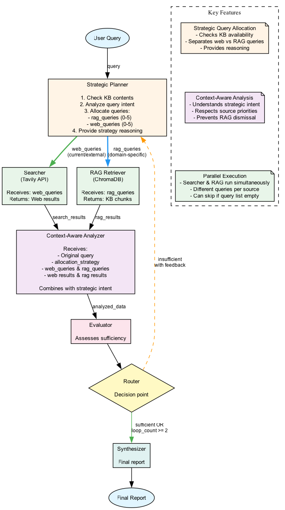

# Agent Graph

This document explains the structure of the agent defined in `src/graph.py`.

The agent is a graph with the following nodes:

- **Planner:** This node takes the user's query and generates a plan for what to do next.
- **Searcher:** This node takes the plan from the planner and uses DuckDuckGo to search the web.
- **Analyzer:** This node analyzes the search results and provides a summary.
- **Evaluator:** This node evaluates the analysis and decides if the information is sufficient to create a comprehensive report.
- **Synthesizer:** This node synthesizes the analysis into a final report.

The agent follows this workflow:

1.  The user provides a query.
2.  The `planner` creates a research plan.
3.  The `searcher` executes the plan and gathers information.
4.  The `analyzer` summarizes the information.
5.  The `evaluator` decides if the information is sufficient.
    - If the information is **sufficient**, the agent proceeds to the `synthesizer`.
    - If the information is **insufficient**, the agent goes back to the `planner` to refine the plan and repeats the process.
6.  The `synthesizer` creates a final report.

Here is a visual representation of the agent's graph:



## Configuration

This section provides an overview of the adjustable variables, parameters, and prompts in the system.

### Output Validation with Pydantic

To ensure the reliability of the agent, we use Pydantic to validate the output of the `planner` and `evaluator` nodes.

#### Planner Output

The `planner` node uses the `Plan` Pydantic model to ensure that it always returns a list of search queries.

```python
from pydantic import BaseModel, Field
from typing import List

class Plan(BaseModel):
    """A plan to answer the user's query."""
    queries: List[str] = Field(description="A list of search queries to answer the user's query.")
```

#### Evaluator Output

The `evaluator` node uses the `Evaluation` Pydantic model to ensure that it always returns a boolean-like decision.

```python
from pydantic import BaseModel, Field

class Evaluation(BaseModel):
    """An evaluation of the sufficiency of the information."""
    is_sufficient: bool = Field(description="Whether the information is sufficient to create a comprehensive report.")
```

### Models

The models used by the nodes are defined in `src/models.py`. You can easily swap out the models by modifying this file.

- `get_planner_model()`: Returns the model used by the planner node.
- `get_analyzer_model()`: Returns the model used by the analyzer node.
- `get_evaluator_model()`: Returns the model used by the evaluator node.
- `get_synthesizer_model()`: Returns the model used by the synthesizer node.

By default, all nodes use the `ChatOllama(model="llama3")` model.

### Prompts

The prompts used by the nodes are defined in `src/prompts/` directory.

- `src/prompts/planner_prompt.py`: Contains the prompt for the planner node.
- `src/prompts/analyzer_prompt.py`: Contains the prompt for the analyzer node.
- `src/prompts/evaluator_prompt.py`: Contains the prompt for the evaluator node.
- `src/prompts/synthesizer_prompt.py`: Contains the prompt for the synthesizer node.

### Searcher

The `searcher` node in `src/nodes/searcher_node.py` uses the `DuckDuckGoSearchRun` tool. You can configure the `region` parameter to change the search language.

```python
search = DuckDuckGoSearchRun(region="en-us")
```