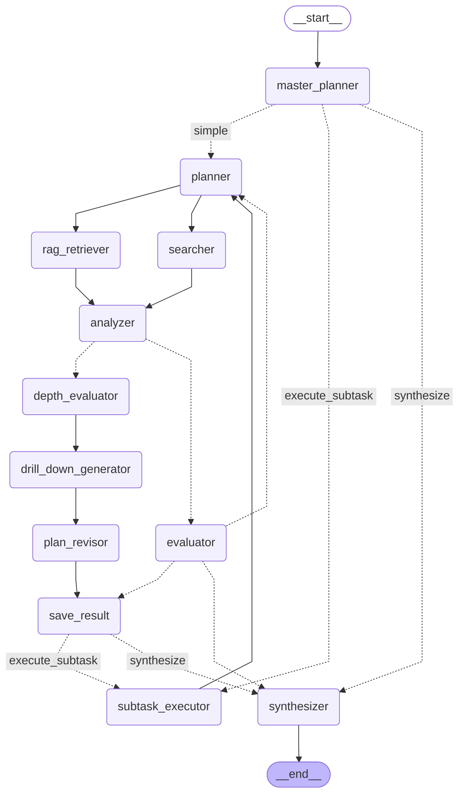

# Deep Research - Graph Visualization

**Description:** Hierarchical multi-agent research with dynamic replanning

**Version:** 2.1

**Complexity:** high

## Use Cases

- Complex multi-faceted research questions
- Topics requiring deep exploration
- Queries benefiting from subtask decomposition
- Adaptive research that discovers new angles mid-execution

## Features

- Hierarchical task decomposition
- Dynamic replanning (Phase 4)
- Depth-aware exploration
- Strategic query allocation (RAG vs Web)
- Recursive drill-down up to 2 levels
- Budget-aware execution control

## Graph Structure

## Viewing Instructions

This diagram can be viewed in:
- GitHub (native Mermaid support)
- VS Code with Mermaid extension
- [Mermaid Live Editor](https://mermaid.live/)
- Convert to PNG: `mmdc -i deep_research_graph.md -o deep_research.png`
