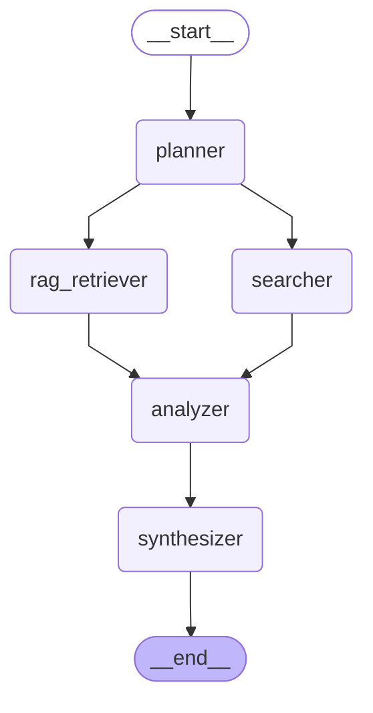

# Fact Check - Graph Visualization

**Description:** Claim verification workflow with evidence analysis

**Version:** 1.0

**Complexity:** medium

## Use Cases

- Verify factual claims
- Check statement accuracy
- Cross-reference information across sources
- Detect contradictions or inconsistencies
- Provide evidence-based assessments with citations

## Features

- Claim extraction and decomposition
- Multi-source evidence gathering (KB + Web)
- Evidence categorization (supporting/contradicting)
- Confidence scoring (0.0-1.0)
- Citation tracking
- Contradiction detection
- Single-pass execution for speed

## Performance

- **avg_execution_time:** 30-45 seconds
- **max_iterations:** 1
- **nodes:** 5

## Graph Structure

## Viewing Instructions

This diagram can be viewed in:
- GitHub (native Mermaid support)
- VS Code with Mermaid extension
- [Mermaid Live Editor](https://mermaid.live/)
- Convert to PNG: `mmdc -i fact_check_graph.md -o fact_check.png`
