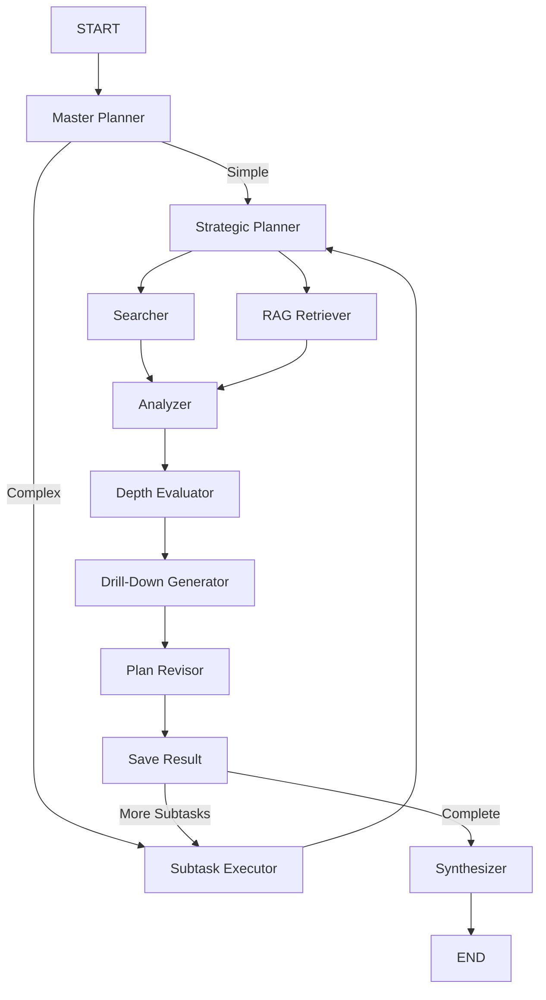
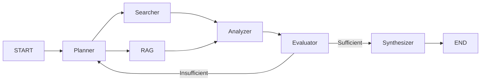
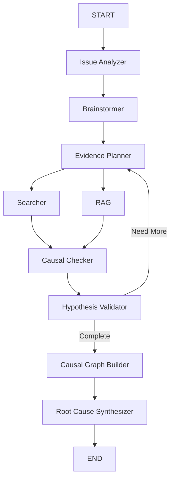

# マルチグラフワークフロー

Test-Smith v2.2は、研究ニーズに基づいて選択できる**5つの専門ワークフローグラフ**を提供します。

---

## 利用可能なグラフ

### 1. Deep Research（デフォルト）

**名前:** `deep_research`

**最適な用途:** 深い探索を必要とする複雑で多面的な質問

**機能:**
- 階層的タスク分解
- サブトピックへの再帰的ドリルダウン
- 発見に基づく動的再計画
- 包括的なマルチセクションレポート

**使用タイミング:**
- クエリに探索すべき複数の側面がある
- 包括的な分析が必要
- トピックが複雑または多面的
- 徹底的な研究のための時間がある（2-5分）

**クエリ例:**
```bash
uv run main.py run "エンタープライズアプリケーション向けマイクロサービスとモノリシックアーキテクチャを比較"
uv run main.py run "2017年から現在までのNLPにおけるTransformerモデルの影響を分析"
```

---

### 2. Quick Research

**名前:** `quick_research`

**最適な用途:** シンプルな質問、高速検索、時間に敏感なニーズ

**機能:**
- シングルパス実行
- 最大2回の改善反復
- 効率化されたワークフロー
- 高速レスポンス（30-60秒）

**使用タイミング:**
- シンプルな事実に関する質問
- 時間が重要
- 深い分析が不要
- クイック検証が必要

**クエリ例:**
```bash
uv run main.py run "ChromaDBとは何ですか？" --graph quick_research
uv run main.py run "Python 3.10はいつリリースされましたか？" --graph quick_research
```

---

### 3. Fact Check

**名前:** `fact_check`

**最適な用途:** 主張の検証、正確性チェック、相互参照

**機能:**
- 証拠の分類（支持、反駁、中立）
- 信頼度スコアリング
- 引用追跡
- 判定生成

**使用タイミング:**
- 特定の主張を検証
- 情報の相互参照が必要
- 発言の正確性を確認
- 誤情報を調査

**クエリ例:**
```bash
uv run main.py run "検証: GPT-4は2023年3月にリリースされた" --graph fact_check
uv run main.py run "Pythonが最も人気のあるプログラミング言語というのは本当ですか？" --graph fact_check
```

---

### 4. Comparative

**名前:** `comparative`

**最適な用途:** サイドバイサイド分析、トレードオフ評価、意思決定支援

**機能:**
- 比較マトリックス生成
- 長所と短所の分析
- ユースケース推奨
- 意思決定フレームワーク

**使用タイミング:**
- 2つ以上のオプションを比較
- 技術的な意思決定が必要
- トレードオフ分析が必要
- 代替案を評価

**クエリ例:**
```bash
uv run main.py run "大規模eコマースアプリケーション向けReact vs Vue" --graph comparative
uv run main.py run "WebアプリケーションバックエンドにPostgreSQL vs MySQL" --graph comparative
```

---

### 5. Causal Inference

**名前:** `causal_inference`

**最適な用途:** 根本原因分析、トラブルシューティング、インシデント調査

**機能:**
- 仮説生成（5-8仮説）
- 証拠ベースの検証
- 因果グラフ可視化
- 信頼レベル付き確率ランキング

**使用タイミング:**
- 問題のトラブルシューティング
- インシデント調査
- なぜ何かが起こったかを理解
- ポストモーテム分析

**クエリ例:**
```bash
uv run main.py run "なぜアプリケーションが高レイテンシを経験しているのですか？" --graph causal_inference
uv run main.py run "火曜日にデータベース接続エラーが発生した原因は？" --graph causal_inference
```

---

## グラフ選択ガイド

### 意思決定マトリックス

| 質問タイプ | 推奨グラフ | 時間 | 深度 |
|---------------|-------------------|------|-------|
| シンプルな事実 | `quick_research` | 30-60秒 | 低 |
| 検証すべき主張 | `fact_check` | 30-45秒 | 中 |
| A vs B比較 | `comparative` | 45-90秒 | 中 |
| なぜXが起こったか？ | `causal_inference` | 60-90秒 | 中 |
| 複雑な分析 | `deep_research` | 2-5分 | 高 |

### 選択フローチャート

```
シンプルな事実に関する質問ですか？
  → はい: quick_research
  → いいえ: 続ける

主張を検証していますか？
  → はい: fact_check
  → いいえ: 続ける

オプションを比較していますか？
  → はい: comparative
  → いいえ: 続ける

トラブルシューティング/調査ですか？
  → はい: causal_inference
  → いいえ: deep_research（デフォルト）
```

---

## コマンド

### 利用可能なグラフを一覧表示

```bash
# 基本リスト
uv run main.py graphs

# 詳細情報
uv run main.py graphs --detailed
```

### 特定のグラフで実行

```bash
uv run main.py run "あなたのクエリ" --graph <graph_name>
```

### 例

```bash
# デフォルト（deep_research）
uv run main.py run "AIフレームワークを分析"

# クイック検索
uv run main.py run "BERTとは？" --graph quick_research

# 主張を検証
uv run main.py run "検証: LangChainはストリーミングをサポート" --graph fact_check

# オプションを比較
uv run main.py run "Kubernetes vs Docker Swarm" --graph comparative

# 根本原因
uv run main.py run "なぜAPIレスポンスが遅いのか？" --graph causal_inference
```

---

## グラフアーキテクチャ

### Deep Researchアーキテクチャ



### Quick Researchアーキテクチャ



### Causal Inferenceアーキテクチャ



---

## パフォーマンス特性

| グラフ | 平均時間 | APIコール | ベストケース | ワーストケース |
|-------|----------|-----------|-----------|------------|
| quick_research | 30-60秒 | 1-2 | 15秒 | 120秒 |
| fact_check | 30-45秒 | 1-2 | 20秒 | 90秒 |
| comparative | 45-90秒 | 2-3 | 30秒 | 150秒 |
| causal_inference | 60-90秒 | 2-4 | 45秒 | 180秒 |
| deep_research | 2-5分 | 5-15 | 60秒 | 10分 |

---

## カスタマイゼーション

### カスタムグラフの作成

詳細な手順は[グラフの作成](../development/creating-graphs.md)を参照してください。

### 既存グラフの変更

`src/graphs/`のファイルを編集:

```python
# src/graphs/quick_research_graph.py
class QuickResearchGraphBuilder(BaseGraphBuilder):
    def build(self) -> StateGraph:
        workflow = StateGraph(QuickResearchState)
        # ノード、エッジ、ルーティングを変更...
        return workflow.compile()
```

---

## ベストプラクティス

### 1. 適切なグラフを選択

シンプルな事実に`deep_research`を使用しないでください - より遅く、過剰です。

### 2. クエリを具体的に

より良いクエリ → より良いグラフ活用。

### 3. 検証にはFact Checkを使用

特定の主張がある場合、一般的な研究の代わりに`fact_check`を使用。

### 4. 意思決定にはComparativeを使用

オプションを比較する場合、`comparative`は構造化された長所/短所分析を生成。

### 5. 時間制約を考慮

時間に敏感な場合、中程度に複雑なクエリでも`quick_research`を使用。

---

## 関連ドキュメント

- **[システム概要](system-overview.md)** - アーキテクチャの詳細
- **[グラフの作成](../development/creating-graphs.md)** - カスタムワークフローの構築
- **[クイックスタート](../getting-started/quick-start.md)** - 基本的な使用方法
