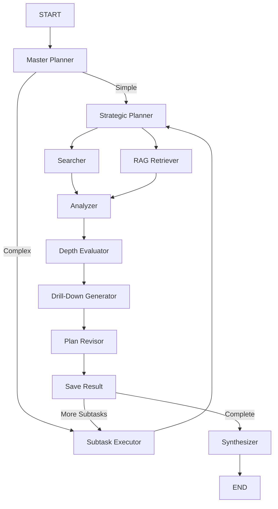
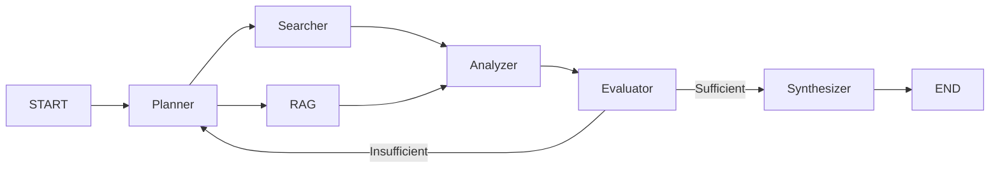
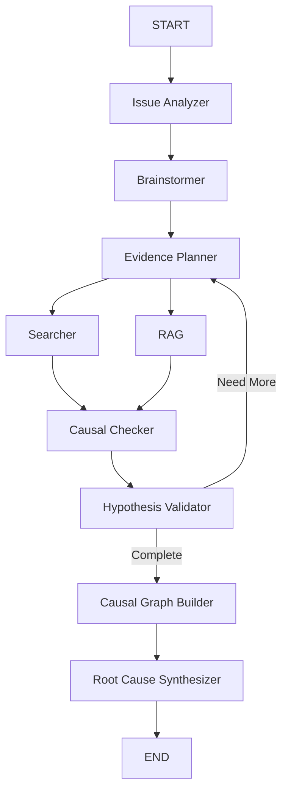

# Multi-Graph Workflows

Test-Smith v2.2 provides **5 specialized workflow graphs** that can be selected based on research needs.

---

## Available Graphs

### 1. Deep Research (default)

**Name:** `deep_research`

**Best For:** Complex multi-faceted questions requiring deep exploration

**Features:**
- Hierarchical task decomposition
- Recursive drill-down into subtopics
- Dynamic replanning based on discoveries
- Comprehensive multi-section reports

**Use When:**
- Query has multiple aspects to explore
- Need comprehensive analysis
- Topic is complex or multi-faceted
- Have time for thorough research (2-5 minutes)

**Example Queries:**
```bash
python main.py run "Compare microservices and monolithic architectures for enterprise applications"
python main.py run "Analyze the impact of transformer models on NLP from 2017 to present"
```

---

### 2. Quick Research

**Name:** `quick_research`

**Best For:** Simple questions, fast lookups, time-sensitive needs

**Features:**
- Single-pass execution
- Max 2 refinement iterations
- Streamlined workflow
- Fast responses (30-60 seconds)

**Use When:**
- Simple factual question
- Time is critical
- Don't need deep analysis
- Quick verification needed

**Example Queries:**
```bash
python main.py run "What is ChromaDB?" --graph quick_research
python main.py run "When was Python 3.10 released?" --graph quick_research
```

---

### 3. Fact Check

**Name:** `fact_check`

**Best For:** Verifying claims, checking accuracy, cross-referencing

**Features:**
- Evidence categorization (supporting, refuting, neutral)
- Confidence scoring
- Citation tracking
- Verdict generation

**Use When:**
- Verifying a specific claim
- Need to cross-reference information
- Checking accuracy of statements
- Investigating misinformation

**Example Queries:**
```bash
python main.py run "Verify: GPT-4 was released in March 2023" --graph fact_check
python main.py run "Is it true that Python is the most popular programming language?" --graph fact_check
```

---

### 4. Comparative

**Name:** `comparative`

**Best For:** Side-by-side analysis, trade-off evaluation, decision support

**Features:**
- Comparison matrix generation
- Pros and cons analysis
- Use case recommendations
- Decision framework

**Use When:**
- Comparing two or more options
- Making technology decisions
- Need trade-off analysis
- Evaluating alternatives

**Example Queries:**
```bash
python main.py run "React vs Vue for a large e-commerce application" --graph comparative
python main.py run "PostgreSQL vs MySQL for web application backend" --graph comparative
```

---

### 5. Causal Inference

**Name:** `causal_inference`

**Best For:** Root cause analysis, troubleshooting, incident investigation

**Features:**
- Hypothesis generation (5-8 hypotheses)
- Evidence-based validation
- Causal graph visualization
- Probability ranking with confidence levels

**Use When:**
- Troubleshooting issues
- Investigating incidents
- Understanding why something happened
- Post-mortem analysis

**Example Queries:**
```bash
python main.py run "Why is my application experiencing high latency?" --graph causal_inference
python main.py run "What caused the database connection errors on Tuesday?" --graph causal_inference
```

---

## Graph Selection Guide

### Decision Matrix

| Question Type | Recommended Graph | Time | Depth |
|---------------|-------------------|------|-------|
| Simple fact | `quick_research` | 30-60s | Low |
| Claim to verify | `fact_check` | 30-45s | Medium |
| A vs B comparison | `comparative` | 45-90s | Medium |
| Why did X happen? | `causal_inference` | 60-90s | Medium |
| Complex analysis | `deep_research` | 2-5 min | High |

### Selection Flowchart

```
Is it a simple factual question?
  → Yes: quick_research
  → No: Continue

Are you verifying a claim?
  → Yes: fact_check
  → No: Continue

Are you comparing options?
  → Yes: comparative
  → No: Continue

Are you troubleshooting/investigating?
  → Yes: causal_inference
  → No: deep_research (default)
```

---

## Commands

### List Available Graphs

```bash
# Basic list
python main.py graphs

# Detailed information
python main.py graphs --detailed
```

### Run with Specific Graph

```bash
python main.py run "Your query" --graph <graph_name>
```

### Examples

```bash
# Default (deep_research)
python main.py run "Analyze AI frameworks"

# Quick lookup
python main.py run "What is BERT?" --graph quick_research

# Verify claim
python main.py run "Verify: LangChain supports streaming" --graph fact_check

# Compare options
python main.py run "Kubernetes vs Docker Swarm" --graph comparative

# Root cause
python main.py run "Why are API responses slow?" --graph causal_inference
```

---

## Graph Architectures

### Deep Research Architecture



### Quick Research Architecture



### Causal Inference Architecture



---

## Performance Characteristics

| Graph | Avg Time | API Calls | Best Case | Worst Case |
|-------|----------|-----------|-----------|------------|
| quick_research | 30-60s | 1-2 | 15s | 120s |
| fact_check | 30-45s | 1-2 | 20s | 90s |
| comparative | 45-90s | 2-3 | 30s | 150s |
| causal_inference | 60-90s | 2-4 | 45s | 180s |
| deep_research | 2-5 min | 5-15 | 60s | 10 min |

---

## Customization

### Creating Custom Graphs

See [Creating Graphs](../development/creating-graphs.md) for detailed instructions.

### Modifying Existing Graphs

Edit files in `src/graphs/`:

```python
# src/graphs/quick_research_graph.py
class QuickResearchGraphBuilder(BaseGraphBuilder):
    def build(self) -> StateGraph:
        workflow = StateGraph(QuickResearchState)
        # Modify nodes, edges, routing...
        return workflow.compile()
```

---

## Best Practices

### 1. Choose Appropriate Graph

Don't use `deep_research` for simple facts - it's slower and overkill.

### 2. Be Specific in Queries

Better queries → better graph utilization.

### 3. Use Fact Check for Verification

When you have a specific claim, use `fact_check` instead of general research.

### 4. Use Comparative for Decisions

When comparing options, `comparative` produces structured pros/cons analysis.

### 5. Consider Time Constraints

If time-sensitive, use `quick_research` even for moderately complex queries.

---

## Related Documentation

- **[System Overview](system-overview.md)** - Architecture details
- **[Creating Graphs](../development/creating-graphs.md)** - Build custom workflows
- **[Quick Start](../getting-started/quick-start.md)** - Basic usage
