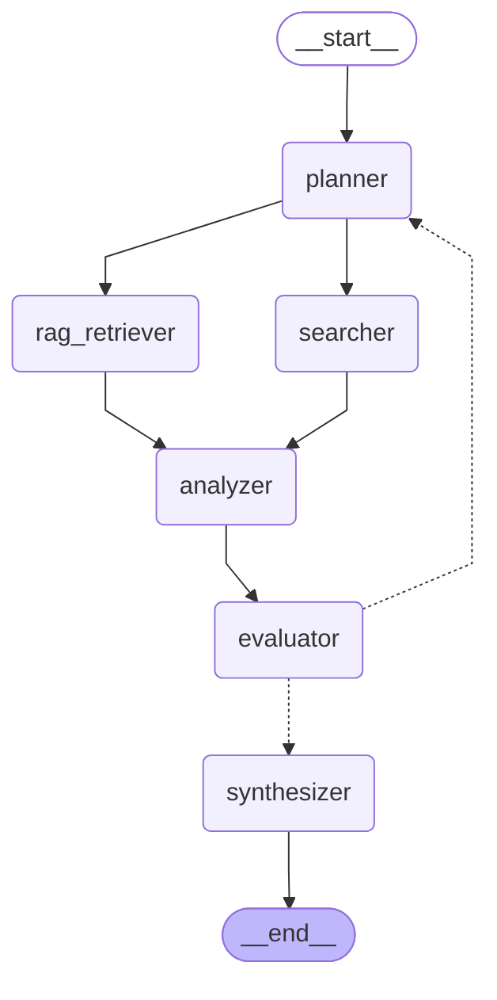

# Comparative Research - Graph Visualization

**Description:** Side-by-side analysis and comparison workflow

**Version:** 1.0

**Complexity:** medium

## Use Cases

- Compare technologies, frameworks, or tools
- Evaluate multiple approaches to a problem
- Side-by-side feature comparison
- Trade-off analysis
- Decision support for choosing between options
- Product/service comparison
- A/B analysis

## Features

- Automatic item extraction from query
- Comparison criteria identification
- Parallel research for each item
- Structured comparison matrix
- Pros/cons analysis
- Use case recommendations
- Decision guidance
- Up to 2 refinement iterations

## Performance

- **avg_execution_time:** 45-90 seconds
- **max_iterations:** 2
- **nodes:** 6

## Graph Structure

## Viewing Instructions

This diagram can be viewed in:
- GitHub (native Mermaid support)
- VS Code with Mermaid extension
- [Mermaid Live Editor](https://mermaid.live/)
- Convert to PNG: `mmdc -i comparative_graph.md -o comparative.png`
