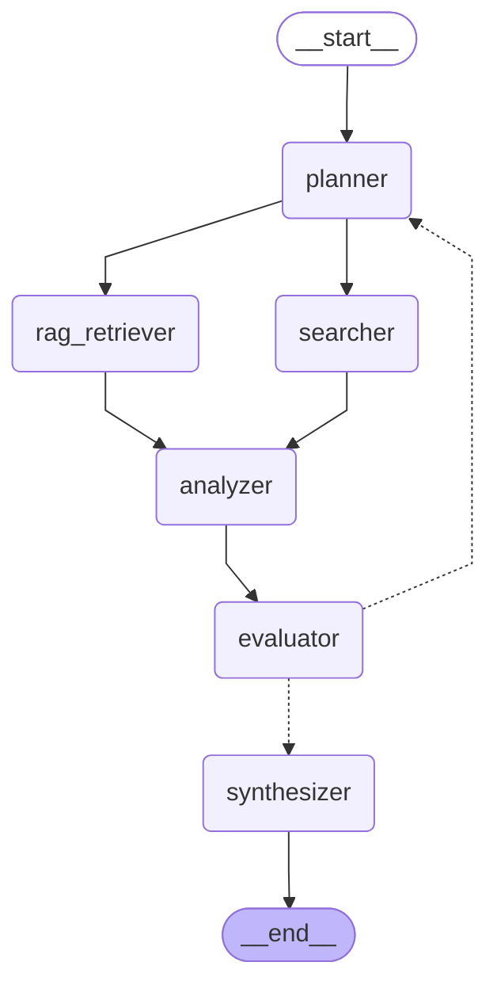

# Quick Research - Graph Visualization

**Description:** Fast single-pass research for simple queries

**Version:** 1.0

**Complexity:** low

## Use Cases

- Simple, straightforward questions
- Quick fact lookups
- Queries that don't require deep exploration
- Time-sensitive research needs
- General knowledge questions

## Features

- Single-pass execution
- Strategic query allocation (RAG vs Web)
- Fast results with minimal overhead
- Maximum 2 refinement iterations
- Parallel RAG and web search

## Performance

- **avg_execution_time:** 30-60 seconds
- **max_iterations:** 2
- **nodes:** 6

## Graph Structure

## Viewing Instructions

This diagram can be viewed in:
- GitHub (native Mermaid support)
- VS Code with Mermaid extension
- [Mermaid Live Editor](https://mermaid.live/)
- Convert to PNG: `mmdc -i quick_research_graph.md -o quick_research.png`
